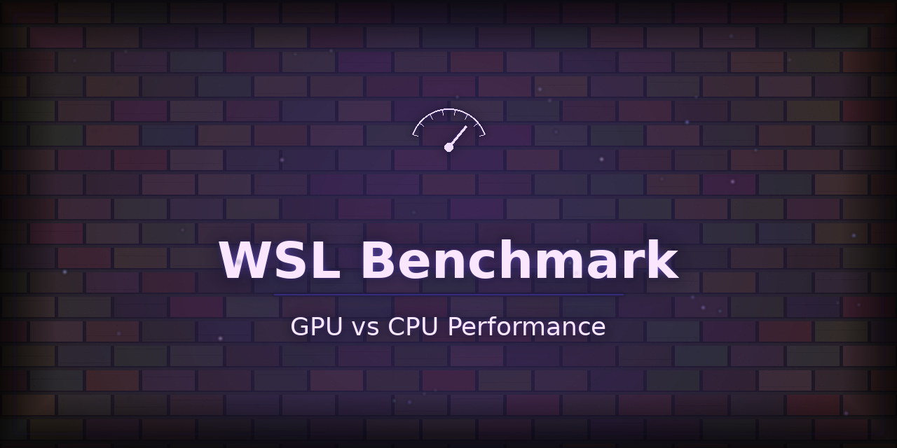

<p align="center"></p>

# wsl-benchmark

GPU vs CPU performance benchmarking for PyTorch and JAX.
Works on AMD ROCm, DirectML, CUDA, MPS, and CPU.
Optimized for RX 5700 XT (gfx1010) in WSL2.

[](https://github.com/ChharithOeun/wsl-benchmark/actions)
[](https://pypi.org/project/wsl-benchmark/)
[](https://pypi.org/project/wsl-benchmark/)
[](LICENSE)

## Install

```bash
pip install wsl-benchmark
```

For GPU support, install PyTorch:
```bash
# CUDA (NVIDIA):
pip install torch

# DirectML (Windows AMD/Intel/NVIDIA):
pip install torch-directml

# ROCm (Linux/WSL2 AMD):
# See: https://rocm.docs.amd.com/en/latest/deploy/linux/index.html
```

## Quick Start

Run a quick benchmark (CPU-only, 64x64 matmul, 1 warmup + 2 runs):

```bash
wsl-benchmark --ops matmul --size 64 --warmup 1 --runs 2
```

Output:
```
================================================================
  WSL-BENCHMARK RESULTS
================================================================
  Device  : cpu
  Platform: Linux 6.8.0-94-generic #94-Ubuntu SMP ...
  Python  : 3.11.9
  PyTorch : not installed
  Size    : 64x64
  Warmup  : 1  Runs: 2
----------------------------------------------------------------
  Op           Backend  Size             Median ms  Stddev ms
----------------------------------------------------------------
  matmul       numpy    64x64                 0.012       0.001
================================================================
```

For JSON output:
```bash
wsl-benchmark --ops matmul --size 64 --warmup 1 --runs 2 --json
```

## What It Benchmarks

| Operation | Description | Input Size |
|-----------|-------------|------------|
| **matmul** | Matrix multiply NxN | 1024x1024 (default) |
| **conv** | 2D convolution (8x64xNxN, kernel=3) | Capped at 256x256 |
| **fft** | 2D Fast Fourier Transform | 1024x1024 |
| **bandwidth** | Memory bandwidth (tensor copy) | 1024x1024 |

## GPU Support

| Device | Backend | Platform | Status |
|--------|---------|----------|--------|
| **AMD RX 5700 XT** | ROCm | Linux/WSL2 | Fully supported (auto HSA_OVERRIDE_GFX_VERSION) |
| **AMD (DirectML)** | DirectML | Windows | Supported |
| **NVIDIA GPU** | CUDA | Linux/Windows | Supported |
| **NVIDIA (DirectML)** | DirectML | Windows | Supported |
| **Intel GPU** | DirectML | Windows | Supported |
| **Apple Silicon** | MPS | macOS | Supported |
| **CPU** | NumPy/PyTorch | All | Always available |

**Note:** wsl-benchmark gracefully falls back to CPU if no GPU is detected.

## CLI Reference

```
usage: wsl-benchmark [-h] [--ops OPS] [--size SIZE] [--warmup WARMUP]
                     [--runs RUNS] [--json] [--version]

Benchmark GPU vs CPU performance for PyTorch/JAX workloads.

options:
  -h, --help         show this help message and exit
  --ops OPS          Comma-separated ops (default: matmul,conv,fft,bandwidth)
  --size SIZE        Matrix dimension N (default: 1024)
  --warmup WARMUP    Warmup iterations (default: 3)
  --runs RUNS        Timed iterations (default: 10)
  --json             Output as JSON instead of table
  --version          Show version
```

### Examples

Default benchmark (all ops, 1024x1024, 3 warmup, 10 runs):
```bash
wsl-benchmark
```

Benchmark matmul and fft only, smaller size, JSON output:
```bash
wsl-benchmark --ops matmul,fft --size 512 --json > results.json
```

Quick sanity check (fast):
```bash
wsl-benchmark --ops matmul --size 128 --warmup 1 --runs 3
```

Stress test (many runs, large matrix):
```bash
wsl-benchmark --warmup 5 --runs 50 --size 2048
```

Safe for limited VRAM:
```bash
wsl-benchmark --size 256   # ~2-4 GB
wsl-benchmark --size 128   # ~1-2 GB
```

## Platform-Specific Setup

### Windows (Native or WSL2) with AMD GPU

**DirectML (recommended for Windows):**
```bash
pip install torch-directml
wsl-benchmark
```

**WSL2 with ROCm:**
```bash
# Install ROCm 6.0+ (see https://rocm.docs.amd.com/)
pip install torch --index-url https://download.pytorch.org/whl/rocm5.7
wsl-benchmark
```

RX 5700 XT (gfx1010) fix:
```bash
export HSA_OVERRIDE_GFX_VERSION=10.3.0
wsl-benchmark
```
(wsl-benchmark sets this automatically)

### Linux with AMD GPU (ROCm)

```bash
# Install ROCm 6.0+
pip install torch --index-url https://download.pytorch.org/whl/rocm5.7
wsl-benchmark
```

For RX 5700 XT:
```bash
export HSA_OVERRIDE_GFX_VERSION=10.3.0
wsl-benchmark
```

### macOS with Apple Silicon

```bash
pip install torch
wsl-benchmark
```

### NVIDIA CUDA (Linux/Windows)

```bash
pip install torch  # includes CUDA support
wsl-benchmark
```

## Use Cases

### Verify GPU is faster than CPU
```bash
wsl-benchmark --json | python3 -c "
import json, sys
d = json.load(sys.stdin)
print('Device:', d['device'])
for r in d['results']:
    print(r['op'], r['median_ms'], 'ms')
"
```

### Save benchmark to file
```bash
wsl-benchmark --json > before.json
# ... upgrade torch ...
wsl-benchmark --json > after.json
```

### Compare results programmatically
```python
import json

before = json.load(open('before.json'))['results']
after = json.load(open('after.json'))['results']

for b, a in zip(before, after):
    diff = ((a['median_ms'] - b['median_ms']) / b['median_ms']) * 100
    print(f"{b['op']}: {b['median_ms']:.1f}ms -> {a['median_ms']:.1f}ms ({diff:+.1f}%)")
```

### CI integration
```bash
# Run in CI/CD pipeline, save results
python -m wsl_benchmark --json > benchmark_results.json
```

### Quick health check
```bash
wsl-benchmark --ops matmul --size 128 --warmup 1 --runs 3
```

## Troubleshooting

### No GPU detected (CPU-only)
This is normal. Install PyTorch and a GPU backend:

**Windows DirectML (easiest):**
```bash
pip install torch-directml
wsl-benchmark
```

**AMD ROCm (Linux/WSL2):**
```bash
# Install ROCm 6.0+ from https://rocm.docs.amd.com/
pip install torch --index-url https://download.pytorch.org/whl/rocm5.7
export HSA_OVERRIDE_GFX_VERSION=10.3.0  # for RX 5700 XT
wsl-benchmark
```

### RX 5700 XT not detected (gfx1010)
wsl-benchmark automatically sets `HSA_OVERRIDE_GFX_VERSION=10.3.0`. If it still fails:

```bash
export HSA_OVERRIDE_GFX_VERSION=10.3.0
python -m wsl_benchmark
```

### Out of Memory
Reduce matrix size:
```bash
wsl-benchmark --size 256   # safe for 4 GB VRAM
wsl-benchmark --size 128   # safe for 2 GB VRAM
```

### Conv op fails on DirectML
DirectML has limited conv support:
```bash
wsl-benchmark --ops matmul,fft,bandwidth
```

### Installation fails (externally-managed-environment)
```bash
pip install wsl-benchmark --break-system-packages
# OR
python -m venv venv && source venv/bin/activate
pip install wsl-benchmark
```

### WSL2 disk full
Use wsl-disk-doctor to clean up:
```bash
# https://github.com/ChharithOeun/wsl-disk-doctor
# On Windows: double-click FIX-WSL-DISK.bat
```

## Related Projects

- **gpu-doctor**: Automatic GPU detection and environment setup
  https://github.com/ChharithOeun/gpu-doctor

- **wsl-disk-doctor**: WSL2 disk optimization and cleanup
  https://github.com/ChharithOeun/wsl-disk-doctor

## Development

Clone and install in editable mode:
```bash
git clone https://github.com/ChharithOeun/wsl-benchmark.git
cd wsl-benchmark
pip install -e .
```

Run tests:
```bash
pip install pytest
pytest tests/
```

Run CLI:
```bash
python -m wsl_benchmark
```

## Architecture

- **runner.py**: Core benchmark engine
  - Sets HSA_OVERRIDE_GFX_VERSION before torch import
  - Auto-detects device (DirectML, ROCm/CUDA, MPS, CPU)
  - Implements matmul, conv, fft, bandwidth ops
  - Handles GPU synchronization for accurate timing

- **report.py**: Result formatting (table, JSON)

- **detect.py**: GPU detection helper (optional gpu_doctor integration)

- **__main__.py**: CLI argument parsing and validation

## License

MIT -- See LICENSE file

## Acknowledgments

- Optimized for RX 5700 XT (gfx1010) on WSL2
- Supports PyTorch and JAX ecosystems
- Cross-platform: Windows, Linux, macOS
- SEO keywords: GPU benchmark, PyTorch benchmark, JAX benchmark, AMD ROCm, DirectML, RX 5700 XT, WSL2 performance, CUDA benchmark, gfx1010
